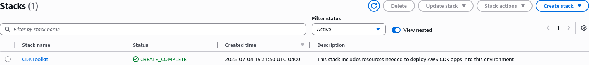

# Project Atlas

Atlas is a full AWS hosted project which serves as example of AWS
usage and deployment, by creating a URL shortener in order to demonstrate
usage of services like Lambda, SQS, ApiGateway, DynamoDB, and more.

This project uses CDK (typescript) in order to deploy all the infrastructure
into AWS cloudformation stacks.

Code for lambdas and more backend services are also in this repository, they're
mostly written in both typescript and golang.

> Atlas is just the initial codename I gave the project when creating it

## Getting started

To get started first you got to install the [AWS cli](https://docs.aws.amazon.com/cli/latest/userguide/getting-started-install.html)
for your operating system (be it Linux, macOS or Windows). Then you
have to configure it using an IAM access key (be it the root user
in the AWS console or as recommended, creating an IAM used with
the proper permissions so then you can use its access key id and secret
access id to login).

> [!NOTE]
> Commands will assume you use bash as your shell, and you're in a unix compliant environment

```shell
aws configure
```

> Use `aws configure` to LogIn in with the right credentials

After logging in you can clone the project and create the CdkToolkit stack using
bootstrap, follow the next instructions to do so:

```shell
git clone https://github.com/AlphaTechnolog/atlas-infra.git ~/work/atlas-infra
cd !$
npm install
npm run cdk bootstrap
# Here you will have to answer some prompts so cdk can know where to bootstrap
# more info in: https://docs.aws.amazon.com/cdk/v2/guide/bootstrapping.html
```

after running cdk bootstrap, you should have something like this
in cloudformation:



If it looks that way, perfect, we can then install the packages for the
js resources (lambdas and layers) and prepare to build all the code.

```shell
cd lambdas/js/
for x in *; do cd $x; npm install; cd -; done
cd ../../layers/* && npm install && cd -
```

Then we can proceed to build all the code, but first make sure you
have the go compiler available:

```shell
go --version
```

If you get the version number, you can then go ahead to the project root
and run the build script

```shell
npm run build:all
```

This will proceed to build all the lambdas, layers, and go projects
in a moment, you should see something like:

```
$ npm run build:all

> atlas-infra@0.1.0 build:all
> bash build-aux/build.sh

== + [JS] ./layers/atlas-url-shortener-layer + ==

> build
> build-aux/build.sh

mkdir: created directory 'out'
mkdir: created directory 'out/nodejs'
'dist/app' -> 'out/nodejs/app'
'dist/app/use-cases' -> 'out/nodejs/app/use-cases'
'dist/app/use-cases/process-url-use-case.js' -> 'out/nodejs/app/use-cases/process-url
...
== + [JS] ./lambdas/js/atlas-url-shortener + ==

> build
> ./build-aux/build.sh

== + [JS] ./lambdas/js/atlas-url-visit-count-subscription-manager + ==

> build
> ./build-aux/build.sh

== + [JS] . + ==

> atlas-infra@0.1.0 build
> tsc

== + [GO] atlas-url-fetcher (./lambdas/go) + ==
===Building atlas-url-fetcher===
  adding: bootstrap (deflated 52%)
== + [GO] atlas-url-consumer (./lambdas/go) + ==
===Building atlas-url-consumer===
  adding: bootstrap (deflated 52%)
== + [GO] atlas-url-listener (./lambdas/go) + ==
===Building atlas-url-listener===
  adding: bootstrap (deflated 52%)
== + [GO] atlas-visit-count-stream-processor (./lambdas/go) + ==
===Building atlas-visit-count-stream-processor===
  adding: bootstrap (deflated 52%)
```

After building all the code we can proceed to deploy the stack in AWS itself

```shell
npm run cdk deploy
```

This will create a new cloudformation stack called `AtlasInfraStack`, which will
contain all the services necessary for the backend.

A frontend project is also available to consume this backend, [check it out](https://github.com/AlphaTechnolog/atlas-frontend).
